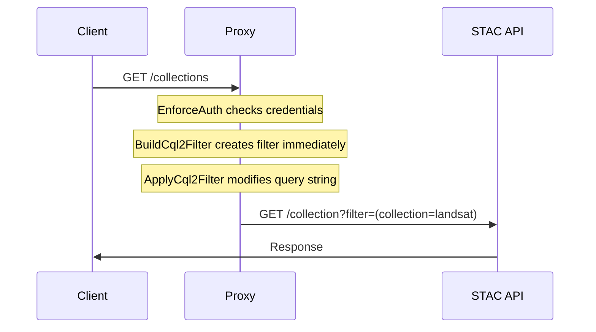

<div align="center">
  <h1 style="font-family: monospace">stac auth proxy</h1>
  <p align="center">Reverse proxy to apply auth*n to STAC APIs.</p>
</div>

---

> [!WARNING]
> This project is currently in active development and may change drastically in the near future while we work towards solidifying a first release.

STAC Auth Proxy is a proxy API that mediates between the client and an internally accessible STAC API to provide a flexible authentication, authorization, and content-filtering mechanism.

## Features

- 🔐 Authentication: Selectively apply OIDC auth to some or all endpoints & methods
- 🎟️ Content Filtering: Apply CQL2 filters to client requests, filtering API content based on user context
- 📖 OpenAPI Augmentation: Update [OpenAPI](https://swagger.io/specification/) with security requirements, keeping auto-generated docs/UIs accurate (e.g. [Swagger UI](https://swagger.io/tools/swagger-ui/))

## Usage

> [!NOTE]
> Currently, the project can only be installed by downloading the repository. It will eventually be available on Docker ([#5](https://github.com/developmentseed/stac-auth-proxy/issues/5)) and PyPi ([#30](https://github.com/developmentseed/stac-auth-proxy/issues/30)).

### Installation

For local development, we use [`uv`](https://docs.astral.sh/uv/) to manage project dependencies and environment.

```sh
uv sync
```

Otherwise, the application can be installed as a standard Python module:

```sh
pip install -e .
```

### Running

The simplest way to run the project is by calling the module directly:

```sh
python -m stac_auth_proxy
```

Alternatively, the application's factory can be passed to Uvicorn:

```sh
uvicorn --factory stac_auth_proxy:create_app
```

### Configuration

The application is configurable via environment variables.

- `UPSTREAM_URL`
  - The STAC API to proxy requests to
  - **Type:** HTTP(S) URL
  - **Required:** Yes
  - **Example:** `https://your-stac-api.com/stac`
- `OIDC_DISCOVERY_URL`
  - OpenID Connect discovery document URL
  - **Type:** HTTP(S) URL
  - **Required:** Yes
  - **Example:** `https://auth.example.com/.well-known/openid-configuration`
- `OIDC_DISCOVERY_INTERNAL_URL`
  - The internal network OpenID Connect discovery document URL
  - **Type:** HTTP(S) URL
  - **Required:** No, defaults to the value of `OIDC_DISCOVERY_URL`
  - **Example:** `http://auth/.well-known/openid-configuration`
- `DEFAULT_PUBLIC`
  - **Description:** Default access policy for endpoints
  - **Type:** boolean
  - **Default:** `false`
  - **Example:** `false`, `1`, `True`
- `PRIVATE_ENDPOINTS`
  - **Description:** Endpoints explicitly marked as requiring authentication, for use when `DEFAULT_PUBLIC == True`
  - **Type:** JSON object mapping regex patterns to HTTP methods OR tuples of HTTP methods and an array of strings representing required scopes
  - **Default:**
    ```json
    {
      "^/collections$": ["POST"],
      "^/collections/([^/]+)$": ["PUT", "PATCH", "DELETE"],
      "^/collections/([^/]+)/items$": ["POST"],
      "^/collections/([^/]+)/items/([^/]+)$": ["PUT", "PATCH", "DELETE"],
      "^/collections/([^/]+)/bulk_items$": ["POST"]
    }
    ```
- `PUBLIC_ENDPOINTS`
  - **Description:** Endpoints explicitly marked as not requiring authentication, for use when `DEFAULT_PUBLIC == False`
  - **Type:** JSON object mapping regex patterns to HTTP methods
  - **Default:**
    ```json
    {
      "^/api.html$": ["GET"],
      "^/api$": ["GET"]
    }
    ```
- `OPENAPI_SPEC_ENDPOINT`
  - Path to serve OpenAPI specification
  - **Type:** string or null
  - **Default:** `null` (disabled)
  - **Example:** `/api`
- `ITEMS_FILTER`
  - Configuration for item-level filtering
  - **Type:** JSON object with class configuration
  - **Default:** `null`
  - Components:
    - `cls`: Python import path
    - `args`: List of positional arguments
    - `kwargs`: Dictionary of keyword arguments
  - **Example:**
    ```json
    {
      "cls": "my_package.filters.OrganizationFilter",
      "args": ["org1"],
      "kwargs": {
        "field_name": "properties.organization"
      }
    }
    ```
- `ITEMS_FILTER_ENDPOINTS`
  - Where to apply item filtering
  - **Type:** JSON object mapping regex patterns to HTTP methods
  - **Default:**
    ```json
    {
      "^/search$": ["GET", "POST"],
      "^/collections/([^/]+)/items$": ["GET", "POST"]
    }
    ```

### Customization

While this project aims to provide utility out-of-the-box as a runnable application, it's likely won't address every project's needs. In these situations, this codebase can instead be treated as a library of components that can be used to augment any webserver that makes use of the [ASGI protocol](https://asgi.readthedocs.io/en/latest/) (e.g. [Django](https://docs.djangoproject.com/en/3.0/topics/async/), [Falcon](https://falconframework.org/), [FastAPI](https://github.com/tiangolo/fastapi), [Litestar](https://litestar.dev/), [Responder](https://responder.readthedocs.io/en/latest/), [Sanic](https://sanic.dev/), [Starlette](https://www.starlette.io/)). Review [`app.py`](https://github.com/developmentseed/stac-auth-proxy/blob/main/src/stac_auth_proxy/app.py) to get a sense of how we make use of the various components to construct a FastAPI application.

## Architecture

### Middleware Stack

The middleware stack is processed in reverse order (bottom to top):

1. **EnforceAuthMiddleware**

   - Handles authentication and authorization
   - Configurable public/private endpoints
   - OIDC integration
   - Places auth token payload in request state

2. **BuildCql2FilterMiddleware**

   - Builds CQL2 filters based on request context/state
   - Places [CQL2 expression](http://developmentseed.org/cql2-rs/latest/python/#cql2.Expr) in request state

3. **ApplyCql2FilterMiddleware**

   - Retrieves [CQL2 expression](http://developmentseed.org/cql2-rs/latest/python/#cql2.Expr) from request state
   - Augments request with CQL2 filter:
     - Modifies query strings for GET requests
     - Modifies JSON bodies for POST/PUT/PATCH requests

4. **OpenApiMiddleware**

   - Modifies OpenAPI specification based on endpoint configuration, adding security requirements
   - Only active if `openapi_spec_endpoint` is configured

5. **AddProcessTimeHeaderMiddleware**
   - Adds processing time headers
   - Useful for monitoring/debugging

### Data filtering via CQL2

The system supports generating CQL2 filters based on request context to provide row-level content filtering. These CQL2 filters are then set on outgoing requests prior to the upstream API.

> [!IMPORTANT]
> The upstream STAC API must support the [STAC API Filter Extension](https://github.com/stac-api-extensions/filter/blob/main/README.md), including the [Features Filter](http://www.opengis.net/spec/ogcapi-features-3/1.0/conf/features-filter) conformance class on to the Features resource (`/collections/{cid}/items`) [#37](https://github.com/developmentseed/stac-auth-proxy/issues/37).

> [!TIP]
> Integration with external authorization systems (e.g. [Open Policy Agent](https://www.openpolicyagent.org/)) can be achieved by replacing the default `BuildCql2FilterMiddleware` with a custom async middleware that is capable of generating [`cql2.Expr` objects](https://developmentseed.org/cql2-rs/latest/python/#cql2.Expr).

#### Example GET Request Flow



#### Filters

| Supported                                                | Method   | Endpoint                                       | Action | Filter     | Strategy                                                                                               |
| -------------------------------------------------------- | -------- | ---------------------------------------------- | ------ | ---------- | ------------------------------------------------------------------------------------------------------ |
| ✅                                                       | `POST`   | `/search`                                      | Read   | Item       | Append body with generated CQL2 query.                                                                 |
| ✅                                                       | `GET`    | `/search`                                      | Read   | Item       | Append query params with generated CQL2 query.                                                         |
| ❌ ([#22](https://github.com/developmentseed/stac-auth-proxy/issues/22)) | `POST`   | `/collections/`                                | Create | Collection | Validate body with generated CQL2 query.                                                               |
| ❌ ([#23](https://github.com/developmentseed/stac-auth-proxy/issues/23)) | `GET`    | `/collections/{collection_id}`                 | Read   | Collection | Append query params with generated CQL2 query.                                                         |
| ❌ ([#22](https://github.com/developmentseed/stac-auth-proxy/issues/22)) | `PUT`    | `/collections/{collection_id}}`                | Update | Collection | Fetch Collection and validate CQL2 query; merge Item with body and validate with generated CQL2 query. |
| ❌ ([#22](https://github.com/developmentseed/stac-auth-proxy/issues/22)) | `DELETE` | `/collections/{collection_id}`                 | Delete | Collection | Fetch Collectiion and validate with CQL2 query.                                                        |
| ✅                                                       | `GET`    | `/collections/{collection_id}/items`           | Read   | Item       | Append query params with generated CQL2 query.                                                         |
| ❌ ([#25](https://github.com/developmentseed/stac-auth-proxy/issues/25)) | `GET`    | `/collections/{collection_id}/items/{item_id}` | Read   | Item       | Validate response against CQL2 query.                                                                  |
| ❌ ([#21](https://github.com/developmentseed/stac-auth-proxy/issues/21)) | `POST`   | `/collections/{collection_id}/items`           | Create | Item       | Validate body with generated CQL2 query.                                                               |
| ❌ ([#21](https://github.com/developmentseed/stac-auth-proxy/issues/21)) | `PUT`    | `/collections/{collection_id}/items/{item_id}` | Update | Item       | Fetch Item and validate CQL2 query; merge Item with body and validate with generated CQL2 query.       |
| ❌ ([#21](https://github.com/developmentseed/stac-auth-proxy/issues/21)) | `DELETE` | `/collections/{collection_id}/items/{item_id}` | Delete | Item       | Fetch Item and validate with CQL2 query.                                                               |
| ❌ ([#21](https://github.com/developmentseed/stac-auth-proxy/issues/21)) | `POST`   | `/collections/{collection_id}/bulk_items`      | Create | Item       | Validate items in body with generated CQL2 query.                                                      |
