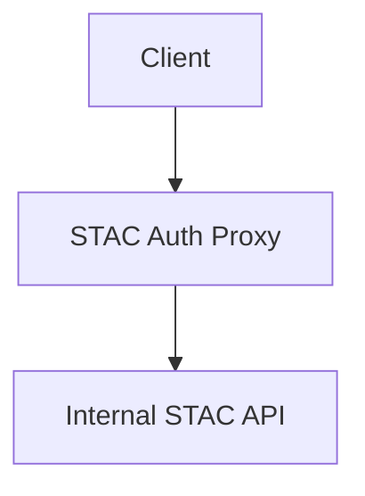
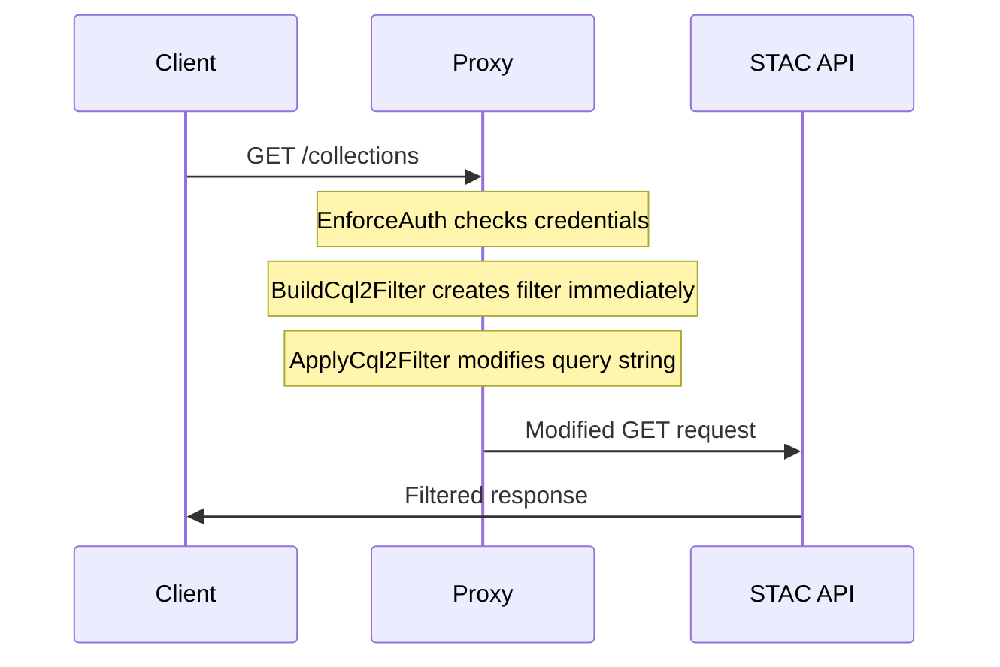
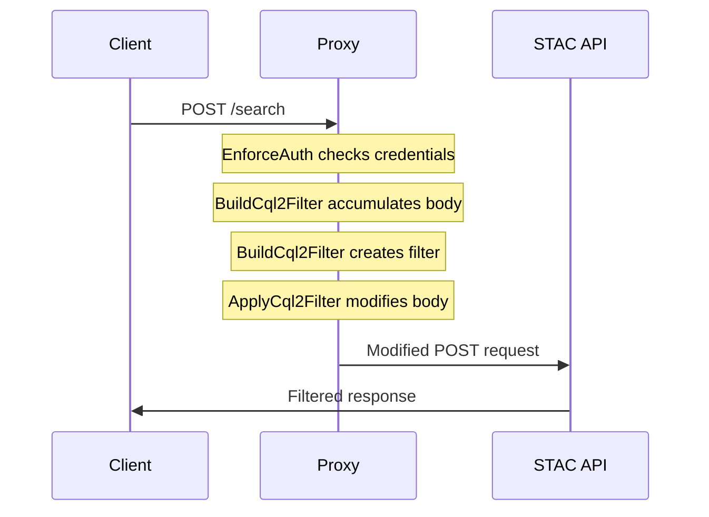

# STAC Auth Proxy

> [!WARNING]
> This project is currently in active development and may change drastically in the near future while we work towards solidifying a first release.

STAC Auth Proxy is a proxy API that mediates between the client and an internally accessible STAC API in order to provide a flexible authentication, authorization, and content filtering mechanism.

## Features

- 🔐 Authentication: Selectively apply OIDC auth to some or all endpoints & methods
- 🎟️ Content Filtering: Apply CQL2 filters to client requests, filtering API content based on user context
- 📖 OpenAPI Augmentation: Update [OpenAPI](https://swagger.io/specification/) with security requirements, keeping auto-generated docs (e.g. [Swagger UI](https://swagger.io/tools/swagger-ui/)) accurate

## Configuration

### Core Settings

- `DEBUG`

  - Enables debug mode and `/_debug` endpoint
  - **Type:** boolean
  - **Default:** `false`
  - **Example:** `true`

- `UPSTREAM_URL`
  - The STAC API to proxy requests to
  - **Type:** HTTP(S) URL
  - **Required:** Yes
  - **Example:** `https://your-stac-api.com/stac`

### Authentication

- `OIDC_DISCOVERY_URL`
  - OpenID Connect discovery document URL
  - **Type:** HTTP(S) URL
  - **Required:** Yes
  - **Example:** `https://auth.example.com/.well-known/openid-configuration`

### Access Control

Routes can be configured as requiring a valid authentication token by by specifying a blanket `default_public` rule and then explicit overrides (`private_endpoints` or `public_endpoints`) when exceptions are necessary.

- `DEFAULT_PUBLIC`

  - **Description:** Default access policy for endpoints
  - **Type:** boolean
  - **Default:** `false`
  - **Example:** `false`, `1`, `True`

- `PRIVATE_ENDPOINTS`

  - **Description:** Endpoints explicitely marked as requiring authentication
  - **Type:** JSON object mapping regex patterns to HTTP methods
  - **Default:**
    ```json
    {
      "^/collections$": ["POST"],
      "^/collections/([^/]+)$": ["PUT", "PATCH", "DELETE"],
      "^/collections/([^/]+)/items$": ["POST"],
      "^/collections/([^/]+)/items/([^/]+)$": ["PUT", "PATCH", "DELETE"],
      "^/collections/([^/]+)/bulk_items$": ["POST"]
    }
    ```

- `PUBLIC_ENDPOINTS`
  - **Description:** Endpoints explicitely marked as not requiring authentication
  - **Type:** JSON object mapping regex patterns to HTTP methods
  - **Default:**
    ```json
    {
      "^/api.html$": ["GET"],
      "^/api$": ["GET"]
    }
    ```

### API Documentation

- `OPENAPI_SPEC_ENDPOINT`
  - Path to serve OpenAPI specification
  - **Type:** string or null
  - **Default:** `null` (disabled)
  - **Example:** `/api`

### Filtering

- `ITEMS_FILTER`

  - Configuration for item-level filtering
  - **Type:** JSON object with class configuration
  - **Default:** `null`
  - Components:
    - `cls`: Python import path
    - `args`: List of positional arguments
    - `kwargs`: Dictionary of keyword arguments
  - **Example:**
    ```json
    {
      "cls": "my_package.filters.OrganizationFilter",
      "args": ["org1"],
      "kwargs": {
        "field_name": "properties.organization"
      }
    }
    ```

- `ITEMS_FILTER_ENDPOINTS`
  - Where to apply item filtering
  - **Type:** JSON object mapping regex patterns to HTTP methods
  - **Default:**
    ```json
    {
      "^/search$": ["POST"],
      "^/collections/([^/]+)/items$": ["GET", "POST"]
    }
    ```

## Architecture

### Application Structure



### Middleware Stack

The middleware stack is processed in reverse order (bottom to top):

1. **EnforceAuthMiddleware**

   - Handles authentication and authorization
   - Configurable public/private endpoints
   - OIDC integration

2. **BuildCql2FilterMiddleware**

   - Builds CQL2 filters based on user context
   - Different handling for GET vs POST/PUT/PATCH requests
   - Stores filter in request state

3. **ApplyCql2FilterMiddleware**

   - Applies the built CQL2 filter to requests
   - Modifies query strings for GET requests
   - Modifies JSON bodies for POST/PUT/PATCH requests

4. **OpenApiMiddleware** (optional)

   - Modifies OpenAPI specification
   - Adds security requirements
   - Only active if `openapi_spec_endpoint` is configured

5. **AddProcessTimeHeaderMiddleware**
   - Adds processing time headers
   - Useful for monitoring/debugging

### Request Flow

#### GET Request Flow



#### POST Request Flow



## Key Components

### CQL2 Filter System

The CQL2 filtering system is split into two middlewares for separation of concerns:

1. **Builder (`BuildCql2FilterMiddleware`)**

   ```python
   async def set_filter(body: Optional[dict] = None) -> None:
       cql2_filter = await filter_builder({
           "req": {
               "path": request.url.path,
               "method": request.method,
               "query_params": dict(request.query_params),
               "path_params": requests.extract_variables(request.url.path),
               "headers": dict(request.headers),
               "body": body,
           },
           **scope["state"],
       })
   ```

   - Creates filters based on request context
   - Handles both GET and POST requests differently
   - Validates filters before applying

2. **Applier (`ApplyCql2FilterMiddleware`)**
   - Modifies requests to include the built filter
   - GET: Modifies query string
   - POST/PUT/PATCH: Modifies JSON body

## Error Handling

- JSON parsing errors are caught and logged
- Filter validation before application
- Authentication errors handled by middleware
- Debug endpoint for troubleshooting (when enabled)

This design provides a robust, secure, and efficient proxy layer for STAC APIs while maintaining flexibility for different deployment scenarios and requirements.

### CQL2 Filters

| Method   | Endpoint                                       | Action | Filter | Strategy                                                                                                   |
| -------- | ---------------------------------------------- | ------ | ------ | ---------------------------------------------------------------------------------------------------------- |
| `POST`   | `/search`                                      | Read   | Item   | Append body with generated CQL2 query.                                                                     |
| `GET`    | `/search`                                      | Read   | Item   | Append query params with generated CQL2 query.                                                             |
| `GET`    | `/collections/{collection_id}/items`           | Read   | Item   | Append query params with generated CQL2 query.                                                             |
| `POST`   | `/collections/{collection_id}/items`           | Create | Item   | Validate body with generated CQL2 query.                                                                   |
| `PUT`    | `/collections/{collection_id}/items/{item_id}` | Update | Item   | Fetch STAC Item and validate CQL2 query; merge STAC Item with body and validate with generated CQL2 query. |
| `DELETE` | `/collections/{collection_id}/items/{item_id}` | Delete | Item   | Fetch STAC Item and validate with CQL2 query.                                                              |

#### Recipes

Only return collections that are mentioned in a `collections` array encoded within the auth token.

```
"A_CONTAINEDBY(id, ('{{ token.collections | join(\"', '\") }}' ))"
```

## Installation

Set up connection to upstream STAC API and the OpenID Connect provider by setting the following environment variables:

```bash
export UPSTREAM_URL="https://some.url"
export OIDC_DISCOVERY_URL="https://your-openid-connect-provider.com/.well-known/openid-configuration"
```

Install software:

```bash
uv run python -m stac_auth_proxy
```
