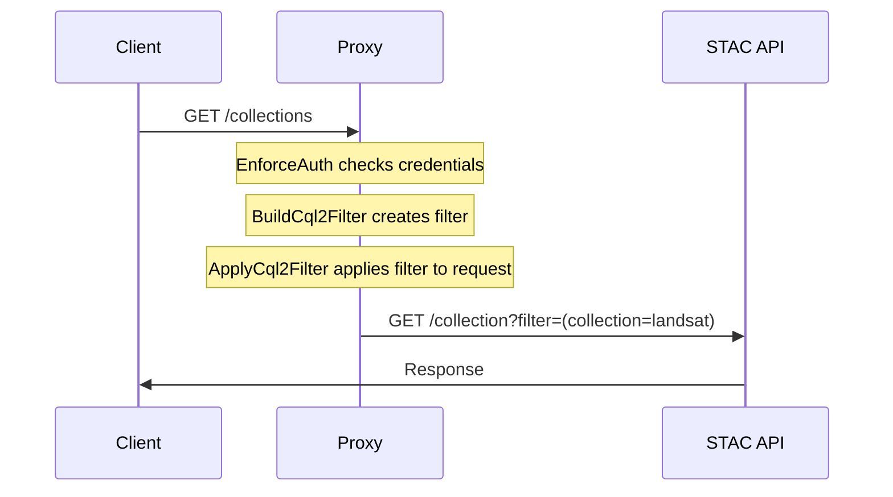

<div align="center">
  <h1 style="font-family: monospace">stac auth proxy</h1>
  <p align="center">Reverse proxy to apply auth*n your STAC API.</p>
</div>

---

> [!WARNING]
> This project is currently in active development and may change drastically in the near future while we work towards solidifying a first release.

STAC Auth Proxy is a proxy API that mediates between the client and your internally accessible STAC API to provide flexible authentication, authorization, and content-filtering mechanisms.

## Features

- 🔐 Authentication: Selectively apply OIDC auth to some or all endpoints & methods
- 🎟️ Content Filtering: Apply CQL2 filters to client requests, filtering API content based on user context
- 📖 OpenAPI Augmentation: Update [OpenAPI](https://swagger.io/specification/) with security requirements, keeping auto-generated docs/UIs accurate (e.g. [Swagger UI](https://swagger.io/tools/swagger-ui/))

## Usage

> [!NOTE]
> Currently, the project can only be installed by downloading the repository. It will eventually be available on Docker ([#5](https://github.com/developmentseed/stac-auth-proxy/issues/5)) and PyPi ([#30](https://github.com/developmentseed/stac-auth-proxy/issues/30)).

### Installation

For local development, we use [`uv`](https://docs.astral.sh/uv/) to manage project dependencies and environment.

```sh
uv sync
```

Otherwise, the application can be installed as a standard Python module:

```sh
pip install -e .
```

### Running

The simplest way to run the project is by calling the module directly:

```sh
python -m stac_auth_proxy
```

Alternatively, the application's factory can be passed to Uvicorn:

```sh
uvicorn --factory stac_auth_proxy:create_app
```

### Configuration

The application is configurable via environment variables.

- Core
  - **`UPSTREAM_URL`**, STAC API URL
    - **Type:** HTTP(S) URL
    - **Required:** Yes
    - **Example:** `https://your-stac-api.com/stac`
  - **`WAIT_FOR_UPSTREAM`**, wait for upstream API to become available before starting proxy
    - **Type:** boolean
    - **Required:** No, defaults to `true`
    - **Example:** `false`, `1`, `True`
  - **`HEALTHZ_PREFIX`**, path prefix for health check endpoints
    - **Type:** string
    - **Required:** No, defaults to `/healthz`
    - **Example:** `''` (disabled)
- Authentication
  - **`OIDC_DISCOVERY_URL`**, OpenID Connect discovery document URL
    - **Type:** HTTP(S) URL
    - **Required:** Yes
    - **Example:** `https://auth.example.com/.well-known/openid-configuration`
  - **`OIDC_DISCOVERY_INTERNAL_URL`**, internal network OpenID Connect discovery document URL
    - **Type:** HTTP(S) URL
    - **Required:** No, defaults to the value of `OIDC_DISCOVERY_URL`
    - **Example:** `http://auth/.well-known/openid-configuration`
  - **`DEFAULT_PUBLIC`**, default access policy for endpoints
    - **Type:** boolean
    - **Required:** No, defaults to `false`
    - **Example:** `false`, `1`, `True`
  - **`PRIVATE_ENDPOINTS`**, endpoints explicitly marked as requiring authentication, used when `DEFAULT_PUBLIC == True`
    - **Type:** JSON object mapping regex patterns to HTTP methods OR tuples of an HTTP method and string representing required scopes
    - **Required:** No, defaults to the following:
      ```json
      {
        "^/collections$": ["POST"],
        "^/collections/([^/]+)$": ["PUT", "PATCH", "DELETE"],
        "^/collections/([^/]+)/items$": ["POST"],
        "^/collections/([^/]+)/items/([^/]+)$": ["PUT", "PATCH", "DELETE"],
        "^/collections/([^/]+)/bulk_items$": ["POST"]
      }
      ```
  - **`PUBLIC_ENDPOINTS`**, endpoints explicitly marked as not requiring authentication, used when `DEFAULT_PUBLIC == False`
    - **Type:** JSON object mapping regex patterns to HTTP methods
    - **Required:** No, defaults to the following:
      ```json
      {
        "^/api.html$": ["GET"],
        "^/api$": ["GET"]
      }
      ```
  - **`OPENAPI_SPEC_ENDPOINT`**, path of OpenAPI specification, used for augmenting spec response with auth configuration
    - **Type:** string or null
    - **Required:** No, defaults to `null` (disabled)
    - **Example:** `/api`
- Filtering
  - **`ITEMS_FILTER`**, [cql2 expression](https://developmentseed.org/cql2-rs/latest/python/#cql2.Expr) generator for item-level filtering
    - **Type:** JSON object with class configuration
    - **Required:** No, defaults to `null` (disabled)
    - **Components**:
      - `cls`: Python import path
      - `args`: List of positional arguments
      - `kwargs`: Dictionary of keyword arguments
    - **Example:**
      ```json
      {
        "cls": "my_package.filters.OrganizationFilter",
        "args": ["org1"],
        "kwargs": {
          "field_name": "properties.organization"
        }
      }
      ```

### Customization

While the project is designed to work out-of-the-box as an application, it might not address every projects needs. When the need for customization arises, the codebase can instead be treated as a library of components that can be used to augment any [ASGI](https://asgi.readthedocs.io/en/latest/)-compliant webserver (e.g. [Django](https://docs.djangoproject.com/en/3.0/topics/async/), [Falcon](https://falconframework.org/), [FastAPI](https://github.com/tiangolo/fastapi), [Litestar](https://litestar.dev/), [Responder](https://responder.readthedocs.io/en/latest/), [Sanic](https://sanic.dev/), [Starlette](https://www.starlette.io/)). Review [`app.py`](https://github.com/developmentseed/stac-auth-proxy/blob/main/src/stac_auth_proxy/app.py) to get a sense of how we make use of the various components to construct a FastAPI application.

## Architecture

### Middleware Stack

The majority of the proxy's functionality occurs within a chain of middlewares. Each request passes through this chain, wherein each middleware performs a specific task:

1. **`EnforceAuthMiddleware`**

   - Handles authentication and authorization
   - Configurable public/private endpoints
   - OIDC integration
   - Places auth token payload in request state

2. **`BuildCql2FilterMiddleware`**

   - Builds CQL2 filters based on request context/state
   - Places [CQL2 expression](http://developmentseed.org/cql2-rs/latest/python/#cql2.Expr) in request state

3. **`ApplyCql2FilterMiddleware`**

   - Retrieves [CQL2 expression](http://developmentseed.org/cql2-rs/latest/python/#cql2.Expr) from request state
   - Augments request with CQL2 filter:
     - Modifies query strings for `GET` requests
     - Modifies JSON bodies for `POST`/`PUT`/`PATCH` requests

4. **`OpenApiMiddleware`**

   - Modifies OpenAPI specification based on endpoint configuration, adding security requirements
   - Only active if `openapi_spec_endpoint` is configured

5. **`AddProcessTimeHeaderMiddleware`**
   - Adds processing time headers
   - Useful for monitoring/debugging

### Data filtering via CQL2

The system supports generating CQL2 filters based on request context to provide row-level content filtering. These CQL2 filters are then set on outgoing requests prior to the upstream API.

> [!IMPORTANT]
> The upstream STAC API must support the [STAC API Filter Extension](https://github.com/stac-api-extensions/filter/blob/main/README.md), including the [Features Filter](http://www.opengis.net/spec/ogcapi-features-3/1.0/conf/features-filter) conformance class on to the Features resource (`/collections/{cid}/items`) [#37](https://github.com/developmentseed/stac-auth-proxy/issues/37).

> [!TIP]
> Integration with external authorization systems (e.g. [Open Policy Agent](https://www.openpolicyagent.org/)) can be achieved by specifying an `ITEMS_FILTER` that points to a class/function that, once initialized, returns a [`cql2.Expr` object](https://developmentseed.org/cql2-rs/latest/python/#cql2.Expr) when called with the request context.

#### Filters

If enabled, filters are intended to be applied to the following endpoints:

- `GET /search`
  - **Supported:** ✅
  - **Action:** Read Item
  - **Applied Filter:** `ITEMS_FILTER`
  - **Strategy:** Append query params with generated CQL2 query.
- `POST /search`
  - **Supported:** ✅
  - **Action:** Read Item
  - **Applied Filter:** `ITEMS_FILTER`
  - **Strategy:** Append body with generated CQL2 query.
- `GET /collections/{collection_id}`
  - **Supported:** ❌ ([#23](https://github.com/developmentseed/stac-auth-proxy/issues/23))
  - **Action:** Read Collection
  - **Applied Filter:** `COLLECTIONS_FILTER`
  - **Strategy:** Append query params with generated CQL2 query.
- `GET /collections/{collection_id}/items`
  - **Supported:** ✅
  - **Action:** Read Item
  - **Applied Filter:** `ITEMS_FILTER`
  - **Strategy:** Append query params with generated CQL2 query.
- `GET /collections/{collection_id}/items/{item_id}`
  - **Supported:** ❌ ([#25](https://github.com/developmentseed/stac-auth-proxy/issues/25))
  - **Action:** Read Item
  - **Applied Filter:** `ITEMS_FILTER`
  - **Strategy:** Validate response against CQL2 query.
- `POST /collections/`
  - **Supported:** ❌ ([#22](https://github.com/developmentseed/stac-auth-proxy/issues/22))
  - **Action:** Create Collection
  - **Applied Filter:** `COLLECTIONS_FILTER`
  - **Strategy:** Validate body with generated CQL2 query.
- `PUT /collections/{collection_id}}`
  - **Supported:** ❌ ([#22](https://github.com/developmentseed/stac-auth-proxy/issues/22))
  - **Action:** Update Collection
  - **Applied Filter:** `COLLECTIONS_FILTER`
  - **Strategy:** Fetch Collection and validate CQL2 query; merge Item with body and validate with generated CQL2 query.
- `DELETE /collections/{collection_id}`
  - **Supported:** ❌ ([#22](https://github.com/developmentseed/stac-auth-proxy/issues/22))
  - **Action:** Delete Collection
  - **Applied Filter:** `COLLECTIONS_FILTER`
  - **Strategy:** Fetch Collectiion and validate with CQL2 query.
- `POST /collections/{collection_id}/items`
  - **Supported:** ❌ ([#21](https://github.com/developmentseed/stac-auth-proxy/issues/21))
  - **Action:** Create Item
  - **Applied Filter:** `ITEMS_FILTER`
  - **Strategy:** Validate body with generated CQL2 query.
- `PUT /collections/{collection_id}/items/{item_id}`
  - **Supported:** ❌ ([#21](https://github.com/developmentseed/stac-auth-proxy/issues/21))
  - **Action:** Update Item
  - **Applied Filter:** `ITEMS_FILTER`
  - **Strategy:** Fetch Item and validate CQL2 query; merge Item with body and validate with generated CQL2 query.
- `DELETE /collections/{collection_id}/items/{item_id}`
  - **Supported:** ❌ ([#21](https://github.com/developmentseed/stac-auth-proxy/issues/21))
  - **Action:** Delete Item
  - **Applied Filter:** `ITEMS_FILTER`
  - **Strategy:** Fetch Item and validate with CQL2 query.
- `POST /collections/{collection_id}/bulk_items`
  - **Supported:** ❌ ([#21](https://github.com/developmentseed/stac-auth-proxy/issues/21))
  - **Action:** Create Items
  - **Applied Filter:** `ITEMS_FILTER`
  - **Strategy:** Validate items in body with generated CQL2 query.

#### Example GET Request Flow


