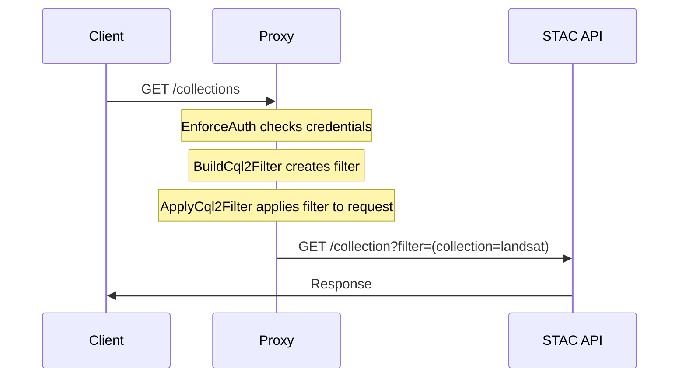
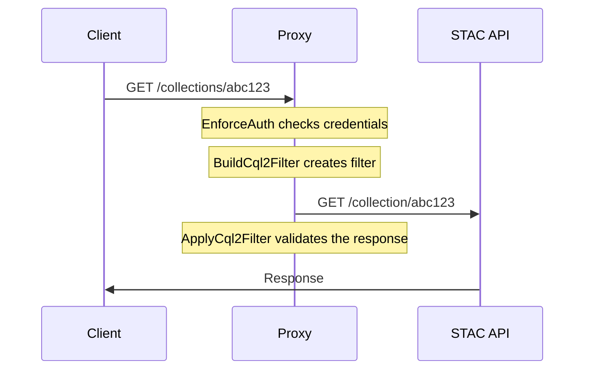

# Data filtering via CQL2

The system supports generating CQL2 filters based on request context to provide row-level content filtering. These CQL2 filters are then set on outgoing requests prior to the upstream API.

> [!IMPORTANT]
> The upstream STAC API must support the [STAC API Filter Extension](https://github.com/stac-api-extensions/filter/blob/main/README.md), including the [Features Filter](http://www.opengis.net/spec/ogcapi-features-3/1.0/conf/features-filter) conformance class on to the Features resource (`/collections/{cid}/items`)[^37].

## Filters

### `ITEMS_FILTER`

The [`ITEMS_FILTER`](../configuration.md#collections_filter_cls) is applied to the following operations.

> [!WARNING]
> Operations without a check mark are not yet supported. We intend to support these operations within the future.

- [x] `GET /search`
  - **Action:** Read Item
  - **Strategy:** Append query params with generated CQL2 query.
- [x] `POST /search`
  - **Action:** Read Item
  - **Strategy:** Append body with generated CQL2 query.
- [x] `GET /collections/{collection_id}/items`
  - **Action:** Read Item
  - **Strategy:** Append query params with generated CQL2 query.
- [x] `GET /collections/{collection_id}/items/{item_id}`
  - **Action:** Read Item
  - **Strategy:** Validate response against CQL2 query.
- [ ] `POST /collections/{collection_id}/items`[^21]
  - **Action:** Create Item
  - **Strategy:** Validate body with generated CQL2 query.
- [ ] `PUT /collections/{collection_id}/items/{item_id}`[^21]
  - **Action:** Update Item
  - **Strategy:** Fetch Item and validate CQL2 query; merge Item with body and validate with generated CQL2 query.
- [ ] `DELETE /collections/{collection_id}/items/{item_id}`[^21]
  - **Action:** Delete Item
  - **Strategy:** Fetch Item and validate with CQL2 query.
- [ ] `POST /collections/{collection_id}/bulk_items`[^21]
  - **Action:** Create Items
  - **Strategy:** Validate items in body with generated CQL2 query.

### `COLLECTIONS_FILTER`

The [`COLLECTIONS_FILTER`](../configuration#collections_filter_cls) applies to the following operations.

> [!WARNING]
> Operations without a check mark are not yet supported. We intend to support these operations within the future.

- [x] `GET /collections`
  - **Action:** Read Collection
  - **Strategy:** Append query params with generated CQL2 query.
- [x] `GET /collections/{collection_id}`
  - **Action:** Read Collection
  - **Strategy:** Validate response against CQL2 query.
- [ ] `POST /collections/`[^22]
  - **Action:** Create Collection
  - **Strategy:** Validate body with generated CQL2 query.
- [ ] `PUT /collections/{collection_id}`[^22]
  - **Action:** Update Collection
  - **Strategy:** Fetch Collection and validate CQL2 query; merge Item with body and validate with generated CQL2 query.
- [ ] `DELETE /collections/{collection_id}`[^22]
  - **Action:** Delete Collection
  - **Strategy:** Fetch Collection and validate with CQL2 query.

## Example Request Flow for multi-record endpoints



## Example Request Flow for single-record endpoints

The Filter Extension does not apply to fetching individual records. As such, we must validate the record _after_ it is returned from the upstream API but _before_ it is returned to the user:



## Authoring Filter Generators

The `ITEMS_FILTER_CLS` configuration option can be used to specify a class that will be used to generate a CQL2 filter for the request. The class must define a `__call__` method that accepts a single argument: a dictionary containing the request context; and returns a valid `cql2-text` expression (as a `str`) or `cql2-json` expression (as a `dict`).

> [!TIP]
> An example integration can be found in [`examples/custom-integration`](https://github.com/developmentseed/stac-auth-proxy/blob/main/examples/custom-integration).

### Basic Filter Generator

```py
import dataclasses
from typing import Any

from cql2 import Expr


@dataclasses.dataclass
class ExampleFilter:
    async def __call__(self, context: dict[str, Any]) -> str:
        return "true"
```

> [!TIP]
> Despite being referred to as a _class_, a filter generator could be written as a function.
>
>   <details>
>
>   <summary>Example</summary>
>
> ```py
> from typing import Any
>
> from cql2 import Expr
>
>
> def example_filter():
>     async def example_filter(context: dict[str, Any]) -> str | dict[str, Any]:
>         return Expr("true")
>     return example_filter
> ```
>
> </details>

### Complex Filter Generator

An example of a more complex filter generator where the filter is generated based on the response of an external API:

```py
import dataclasses
from typing import Any, Literal, Optional

from httpx import AsyncClient
from stac_auth_proxy.utils.cache import MemoryCache


@dataclasses.dataclass
class ApprovedCollectionsFilter:
    api_url: str
    kind: Literal["item", "collection"] = "item"
    client: AsyncClient = dataclasses.field(init=False)
    cache: MemoryCache = dataclasses.field(init=False)

    def __post_init__(self):
        # We keep the client in the class instance to avoid creating a new client for
        # each request, taking advantage of the client's connection pooling.
        self.client = AsyncClient(base_url=self.api_url)
        self.cache = MemoryCache(ttl=30)

    async def __call__(self, context: dict[str, Any]) -> dict[str, Any]:
        token = context["req"]["headers"].get("authorization")

        try:
            # Check cache for a previously generated filter
            approved_collections = self.cache[token]
        except KeyError:
            # Lookup approved collections from an external API
            approved_collections = await self.lookup(token)
            self.cache[token] = approved_collections

        # Build CQL2 filter
        return {
            "op": "a_containedby",
            "args": [
                {"property": "collection" if self.kind == "item" else "id"},
                approved_collections
            ],
        }

    async def lookup(self, token: Optional[str]) -> list[str]:
        # Lookup approved collections from an external API
        headers = {"Authorization": f"Bearer {token}"} if token else {}
        response = await self.client.get(
            f"/get-approved-collections",
            headers=headers,
        )
        response.raise_for_status()
        return response.json()["collections"]
```

> [!TIP]
> Filter generation runs for every relevant request. Consider memoizing external API calls to improve performance.

[^21]: https://github.com/developmentseed/stac-auth-proxy/issues/21
[^22]: https://github.com/developmentseed/stac-auth-proxy/issues/22
[^37]: https://github.com/developmentseed/stac-auth-proxy/issues/37
